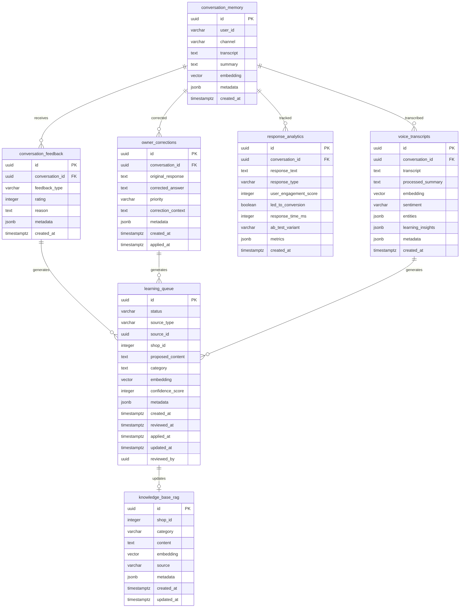
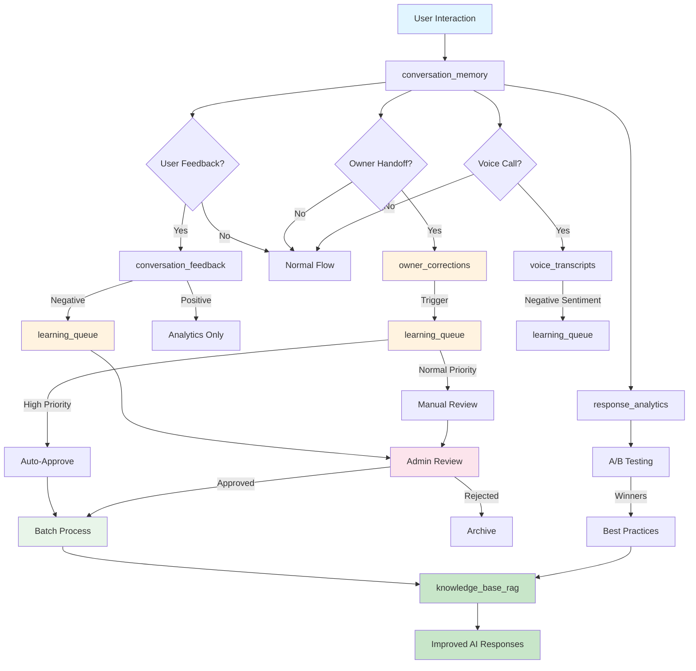
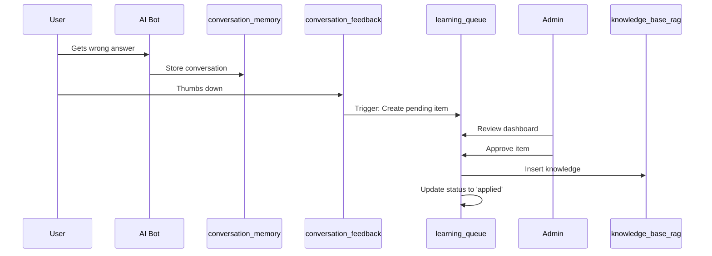
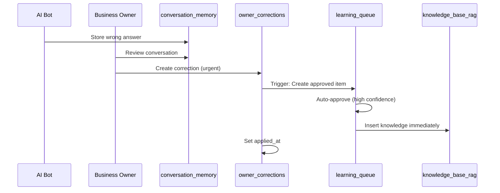
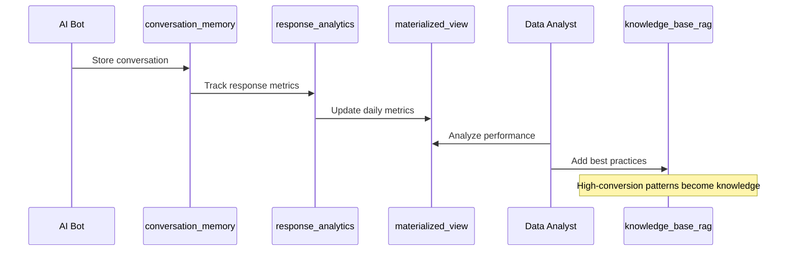

# Entity Relationship Diagrams

## Overview

Visual representation of the learning database schema and its relationship with the existing RAG system.

---

## Complete System ERD



---

## Learning Pipeline Flow



---

## Table Details

### conversation_feedback

**Purpose**: Track user reactions to AI responses

| Column | Type | Description |
|--------|------|-------------|
| id | UUID | Primary key |
| conversation_id | UUID | FK to conversation_memory |
| feedback_type | VARCHAR(20) | thumbs_up, thumbs_down, star_rating, emoji |
| rating | INTEGER | 1-5 stars (optional) |
| reason | TEXT | User explanation (optional) |
| metadata | JSONB | Additional context |
| created_at | TIMESTAMPTZ | Timestamp |

**Relationships:**
- Belongs to: conversation_memory
- Has many: learning_queue (via trigger)

**Indexes:**
- conversation_id (for lookups)
- feedback_type (for analytics)
- (feedback_type, created_at) (for trends)

---

### owner_corrections

**Purpose**: Store business owner corrections during handoff

| Column | Type | Description |
|--------|------|-------------|
| id | UUID | Primary key |
| conversation_id | UUID | FK to conversation_memory |
| original_response | TEXT | What AI said |
| corrected_answer | TEXT | What owner said |
| priority | VARCHAR(20) | low, normal, high, urgent |
| correction_context | TEXT | When to apply |
| metadata | JSONB | Additional context |
| created_at | TIMESTAMPTZ | Timestamp |
| applied_at | TIMESTAMPTZ | When applied to knowledge |

**Relationships:**
- Belongs to: conversation_memory
- Has many: learning_queue (via trigger)

**Indexes:**
- conversation_id (for lookups)
- priority (for processing order)
- applied_at (partial: NULL for unapplied)
- (priority, created_at) (for priority queue)

---

### learning_queue

**Purpose**: Staging area for knowledge updates

| Column | Type | Description |
|--------|------|-------------|
| id | UUID | Primary key |
| status | VARCHAR(20) | pending, approved, rejected, applied |
| source_type | VARCHAR(20) | feedback, correction, transcript, manual |
| source_id | UUID | ID of source record |
| shop_id | INTEGER | Shop identifier |
| proposed_content | TEXT | New knowledge to add |
| category | TEXT | Knowledge category |
| embedding | VECTOR(768) | For duplicate detection |
| confidence_score | INTEGER | 0-100, for auto-approval |
| metadata | JSONB | Additional context |
| created_at | TIMESTAMPTZ | Timestamp |
| reviewed_at | TIMESTAMPTZ | When reviewed |
| applied_at | TIMESTAMPTZ | When applied to knowledge |
| updated_at | TIMESTAMPTZ | Auto-updated on changes |
| reviewed_by | UUID | Admin who reviewed |

**Relationships:**
- References: conversation_feedback (via source_id)
- References: owner_corrections (via source_id)
- References: voice_transcripts (via source_id)
- Updates: knowledge_base_rag

**Indexes:**
- status (for filtering)
- shop_id (for per-shop queues)
- source_type (for analytics)
- (status, created_at) (for processing order)
- confidence_score (for sorting)
- embedding HNSW (for similarity search)

**Partial Indexes:**
- (shop_id, created_at) WHERE status = 'pending'

---

### response_analytics

**Purpose**: Track AI response performance

| Column | Type | Description |
|--------|------|-------------|
| id | UUID | Primary key |
| conversation_id | UUID | FK to conversation_memory |
| response_text | TEXT | What AI said |
| response_type | VARCHAR(50) | Category of response |
| user_engagement_score | INTEGER | 0-100 engagement |
| led_to_conversion | BOOLEAN | Converted to sale/booking |
| response_time_ms | INTEGER | Generation time |
| ab_test_variant | VARCHAR(50) | A/B test ID |
| metrics | JSONB | Additional metrics |
| created_at | TIMESTAMPTZ | Timestamp |

**Relationships:**
- Belongs to: conversation_memory

**Indexes:**
- conversation_id (for lookups)
- response_type (for comparison)
- created_at (for time-series)
- ab_test_variant (for A/B testing)
- (response_type, created_at) (for trends)
- led_to_conversion (for conversion tracking)

---

### voice_transcripts

**Purpose**: Voice communication with sentiment analysis

| Column | Type | Description |
|--------|------|-------------|
| id | UUID | Primary key |
| conversation_id | UUID | FK to conversation_memory (nullable) |
| transcript | TEXT | Full transcript |
| processed_summary | TEXT | AI summary |
| embedding | VECTOR(768) | For semantic search |
| sentiment | VARCHAR(20) | positive, neutral, negative, mixed |
| entities | JSONB | Extracted entities |
| learning_insights | JSONB | AI-extracted patterns |
| metadata | JSONB | Additional context |
| created_at | TIMESTAMPTZ | Timestamp |

**Relationships:**
- Belongs to: conversation_memory (optional)
- Has many: learning_queue (optional)

**Indexes:**
- conversation_id (for lookups)
- sentiment (for filtering)
- created_at (for time-series)
- embedding HNSW (for similarity search)
- entities GIN (for entity search)

**Partial Indexes:**
- (conversation_id, created_at) WHERE sentiment = 'negative'

---

## Learning Flows

### Flow 1: Negative Feedback



### Flow 2: Owner Correction



### Flow 3: Analytics to Knowledge



---

## Index Strategy

### B-tree Indexes (Standard)

```sql
-- Foreign keys and lookups
idx_feedback_conversation
idx_corrections_conversation
idx_analytics_conversation
idx_transcripts_conversation

-- Status and type filtering
idx_learning_status
idx_learning_source_type
idx_feedback_type
idx_corrections_priority
idx_transcripts_sentiment
idx_analytics_response_type
idx_analytics_ab_variant

-- Time-series queries
idx_feedback_created_at
idx_corrections_applied_at
idx_learning_created_at
idx_analytics_created_at
idx_transcripts_created_at

-- Composite indexes
idx_feedback_type_created
idx_corrections_priority_created
idx_learning_status_created
idx_analytics_type_created
```

### HNSW Indexes (Vector Similarity)

```sql
-- For semantic search and duplicate detection
idx_learning_embedding_hnsw
idx_transcripts_embedding_hnsw
-- Note: knowledge_base_rag already has HNSW from migration 001
```

### GIN Indexes (JSONB)

```sql
-- For JSONB metadata searches
idx_transcripts_entities
```

### Partial Indexes (Optimization)

```sql
-- Only index pending items
idx_learning_pending
WHERE status = 'pending'

-- Only index unapplied corrections
idx_corrections_pending
WHERE applied_at IS NULL

-- Only index negative sentiment
idx_transcripts_negative
WHERE sentiment = 'negative'
```

---

## Partitioning Strategy (Future)

When tables exceed 10M rows, implement partitioning:

```sql
-- Partition by created_at (monthly)
conversation_feedback
├── conversation_feedback_2025_01
├── conversation_feedback_2025_02
└── conversation_feedback_2025_03

response_analytics
├── response_analytics_2025_01
├── response_analytics_2025_02
└── response_analytics_2025_03
```

---

## Materialized Views

### daily_learning_metrics

```sql
SELECT
  DATE(created_at) as date,
  shop_id,
  source_type,
  status,
  COUNT(*) as count,
  AVG(confidence_score) as avg_confidence
FROM learning_queue
GROUP BY DATE(created_at), shop_id, source_type, status
```

**Refresh**: Nightly via cron job

### response_performance_metrics

```sql
SELECT
  response_type,
  DATE(created_at) as date,
  COUNT(*) as total_responses,
  AVG(user_engagement_score) as avg_engagement,
  conversion_rate,
  AVG(response_time_ms) as avg_response_time
FROM response_analytics
GROUP BY response_type, DATE(created_at)
```

**Refresh**: Hourly via cron job

---

## Triggers

### Auto-Learning Triggers

1. **trg_feedback_learning**
   - Table: conversation_feedback
   - Event: AFTER INSERT
   - Condition: feedback_type = 'thumbs_down' OR rating <= 2
   - Action: Create learning_queue entry (confidence: 50, status: pending)

2. **trg_corrections_learning**
   - Table: owner_corrections
   - Event: AFTER INSERT
   - Action: Create learning_queue entry (confidence: 70-95, status: approved/pending)

3. **trg_learning_queue_updated_at**
   - Table: learning_queue
   - Event: BEFORE UPDATE
   - Action: Set updated_at = NOW()

---

## Data Volume Estimates

### Monthly Growth (per shop)

| Table | Est. Monthly | Year 1 | Year 2 |
|-------|--------------|--------|--------|
| conversation_feedback | 300K | 3.6M | 7.2M |
| owner_corrections | 3K | 36K | 72K |
| learning_queue | 150K | 1.8M | 3.6M |
| response_analytics | 300K | 3.6M | 7.2M |
| voice_transcripts | 30K | 360K | 720K |

### Storage Requirements

Assuming:
- Average row size: 1KB (including indexes)
- Compression: 2x

| Table | Monthly | Year 1 | Year 2 |
|-------|---------|--------|--------|
| conversation_feedback | 150MB | 1.8GB | 3.6GB |
| owner_corrections | 1.5MB | 18MB | 36MB |
| learning_queue | 75MB | 900MB | 1.8GB |
| response_analytics | 150MB | 1.8GB | 3.6GB |
| voice_transcripts | 15MB | 180MB | 360MB |
| **Total** | **~400MB** | **~4.7GB** | **~9.4GB** |

---

## Query Patterns

### Pattern 1: Fetch Pending Items

```sql
-- Frequency: Every minute (dashboard refresh)
-- Complexity: O(log n) with partial index
SELECT * FROM learning_queue
WHERE status = 'pending'
ORDER BY created_at ASC
LIMIT 100;
```

### Pattern 2: Similarity Search

```sql
-- Frequency: On every learning_queue insert
-- Complexity: O(log n) with HNSW index
SELECT * FROM check_similar_knowledge(shop_id, content, embedding);
```

### Pattern 3: Analytics Aggregation

```sql
-- Frequency: Hourly (materialized view refresh)
-- Complexity: O(n) full scan, mitigated by partitioning
REFRESH MATERIALIZED VIEW response_performance_metrics;
```

### Pattern 4: Batch Processing

```sql
-- Frequency: Hourly
-- Complexity: O(batch_size * log n)
SELECT batch_process_learning(100);
```

---

## Performance Characteristics

### Write Performance

| Operation | Without Indexes | With Indexes | Notes |
|-----------|----------------|--------------|-------|
| Insert feedback | ~1ms | ~2ms | 3 indexes |
| Insert correction | ~1ms | ~3ms | 4 indexes |
| Insert analytics | ~1ms | ~4ms | 6 indexes |
| Batch process 100 | N/A | ~500ms | Includes knowledge inserts |

### Read Performance

| Query | Complexity | Est. Time | Notes |
|-------|-----------|-----------|-------|
| Get pending items | O(log n) | <10ms | Partial index |
| Similarity search | O(log n) | ~50ms | HNSW approximation |
| Analytics dashboard | O(1) | <5ms | Materialized view |
| Conversation lookup | O(log n) | <5ms | B-tree index |

---

## Backup Strategy

### Daily Backup

```bash
# Full backup including learning tables
pg_dump -h localhost -U postgres -d cutting_edge \
  -t conversation_feedback \
  -t owner_corrections \
  -t learning_queue \
  -t response_analytics \
  -t voice_transcripts \
  -f learning_backup_$(date +%Y%m%d).sql
```

### Point-in-Time Recovery

Enable WAL archiving for learning tables:

```sql
ALTER SYSTEM SET wal_level = logical;
ALTER SYSTEM SET archive_mode = on;
ALTER SYSTEM SET archive_command = 'cp %p /backup/wal/%f';
```

---

## Migration Path

### Phase 1: Schema Deployment (Day 0)
- Run migration 002_create_learning_tables.sql
- Verify tables and indexes created
- Test triggers and functions

### Phase 2: Integration (Week 1)
- Update application code to write feedback
- Implement admin dashboard for queue review
- Test batch processing

### Phase 3: Monitoring (Week 2)
- Set up alerts for queue depth
- Monitor learning velocity
- Track quality metrics

### Phase 4: Optimization (Month 1)
- Analyze query performance
- Add missing indexes if needed
- Implement partitioning if tables grow

### Phase 5: Advanced Features (Month 3)
- Implement A/B testing
- Add voice sentiment analysis
- Create advanced analytics

---

## Summary

The learning database consists of:

- **5 new tables** for feedback, corrections, queue, analytics, and transcripts
- **26 indexes** (including HNSW, GIN, and partial indexes)
- **3 triggers** for auto-learning
- **5 functions** for duplicate detection and batch processing
- **2 materialized views** for analytics
- **Complete audit trail** via learning_audit_log

The design prioritizes:
- Data integrity with foreign keys and constraints
- Performance with strategic indexing
- Scalability with partitioning strategy
- Automation with triggers
- Monitoring with analytics views

All files created:
- `/services/handoff-api/database/learning_schema_design.md` (comprehensive design)
- `/services/handoff-api/database/migrations/002_create_learning_tables.sql` (migration)
- `/services/handoff-api/database/LEARNING_FLOW_GUIDE.md` (learning pipelines)
- `/services/handoff-api/database/README.md` (quick reference)
- `/services/handoff-api/database/ERD_DIAGRAM.md` (this file)
