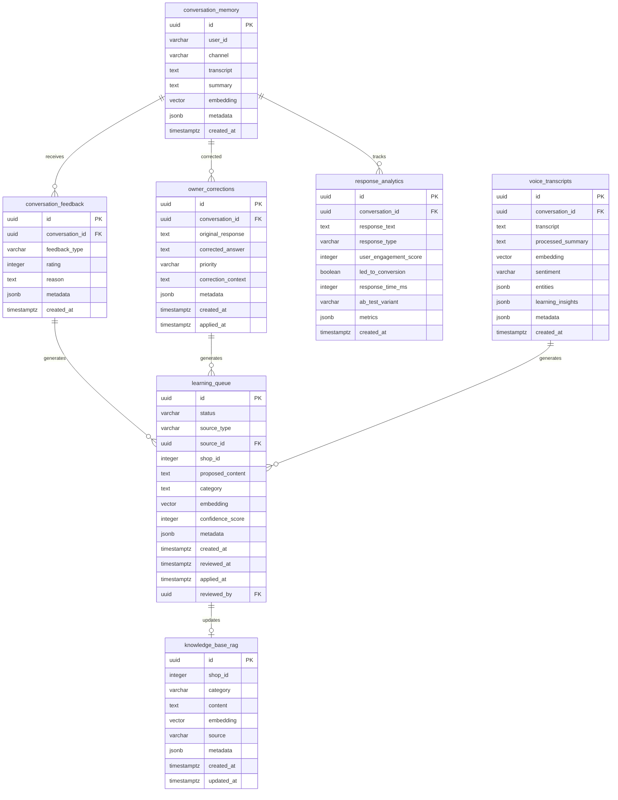

# Learning Database Schema Design

## Overview

This document describes the database schema for a continuous learning AI system that enables the AI to improve from user feedback, owner corrections, and conversation analytics. The design integrates with the existing RAG system (`knowledge_base_rag`, `conversation_memory`) to create a closed-loop learning pipeline.

## Design Principles

1. **Data Integrity First**: All relationships enforced with foreign keys
2. **Query-Driven Design**: Indexes optimized for actual query patterns
3. **Scalability**: Partitioning strategy for high-volume tables
4. **Audit Trail**: All changes tracked with timestamps and user context
5. **Learning Pipeline**: Clear flow from feedback → queue → knowledge

---

## Entity Relationship Diagram



---

## Table Definitions

### 1. conversation_feedback

**Purpose**: Capture user reactions (thumbs up/down, ratings) to AI responses for learning what works well.

```sql
CREATE TABLE conversation_feedback (
    id UUID PRIMARY KEY DEFAULT gen_random_uuid(),
    conversation_id UUID NOT NULL REFERENCES conversation_memory(id) ON DELETE CASCADE,
    feedback_type VARCHAR(20) NOT NULL CHECK (feedback_type IN ('thumbs_up', 'thumbs_down', 'star_rating', 'emoji')),
    rating INTEGER CHECK (rating >= 1 AND rating <= 5),
    reason TEXT,
    metadata JSONB DEFAULT '{}'::jsonb,
    created_at TIMESTAMPTZ DEFAULT CURRENT_TIMESTAMP
);
```

**Indexes**:
- `conversation_id` - Fast lookup of feedback for a conversation
- `feedback_type` - Analytics on feedback patterns
- `created_at` - Time-series analysis
- Composite `(feedback_type, created_at)` - Trend analysis

**Triggers**:
- Auto-generate learning queue entry for negative feedback

**Query Patterns**:
- Get all feedback for a conversation
- Calculate average rating by time period
- Find conversations with negative feedback
- Aggregate feedback trends

---

### 2. owner_corrections

**Purpose**: Store corrections made by business owners during handoff when AI gets something wrong.

```sql
CREATE TABLE owner_corrections (
    id UUID PRIMARY KEY DEFAULT gen_random_uuid(),
    conversation_id UUID NOT NULL REFERENCES conversation_memory(id) ON DELETE CASCADE,
    original_response TEXT NOT NULL,
    corrected_answer TEXT NOT NULL,
    priority VARCHAR(20) NOT NULL DEFAULT 'normal' CHECK (priority IN ('low', 'normal', 'high', 'urgent')),
    correction_context TEXT,
    metadata JSONB DEFAULT '{}'::jsonb,
    created_at TIMESTAMPTZ DEFAULT CURRENT_TIMESTAMP,
    applied_at TIMESTAMPTZ
);
```

**Indexes**:
- `conversation_id` - Link to conversation
- `priority` - Process urgent corrections first
- `applied_at` - Find unapplied corrections (NULL)
- `(priority, created_at)` - Priority queue processing

**Triggers**:
- Auto-gerate high-priority learning queue entry

**Query Patterns**:
- Get unapplied corrections for a shop
- Process corrections by priority
- Track correction history

---

### 3. learning_queue

**Purpose**: Staging area for knowledge updates before they're applied to the knowledge base.

```sql
CREATE TABLE learning_queue (
    id UUID PRIMARY KEY DEFAULT gen_random_uuid(),
    status VARCHAR(20) NOT NULL DEFAULT 'pending' CHECK (status IN ('pending', 'approved', 'rejected', 'applied')),
    source_type VARCHAR(20) NOT NULL CHECK (source_type IN ('feedback', 'correction', 'transcript', 'manual')),
    source_id UUID,
    shop_id INTEGER NOT NULL,
    proposed_content TEXT NOT NULL,
    category TEXT,
    embedding VECTOR(768),
    confidence_score INTEGER CHECK (confidence_score >= 0 AND confidence_score <= 100),
    metadata JSONB DEFAULT '{}'::jsonb,
    created_at TIMESTAMPTZ DEFAULT CURRENT_TIMESTAMP,
    reviewed_at TIMESTAMPTZ,
    applied_at TIMESTAMPTZ,
    reviewed_by UUID
);
```

**Indexes**:
- `status` - Filter pending items
- `shop_id` - Per-shop learning queues
- `source_type` - Analytics on learning sources
- `(status, created_at)` - Process pending items in order
- `confidence_score` - Sort by confidence
- `embedding` - Vector similarity search to detect duplicates

**Triggers**:
- Update `reviewed_at` when status changes
- Auto-apply high-confidence items (configurable threshold)

**Query Patterns**:
- Get pending items for review
- Check for similar existing knowledge
- Batch processing by shop
- Track learning velocity

---

### 4. response_analytics

**Purpose**: Track metrics about AI responses to enable A/B testing and performance optimization.

```sql
CREATE TABLE response_analytics (
    id UUID PRIMARY KEY DEFAULT gen_random_uuid(),
    conversation_id UUID NOT NULL REFERENCES conversation_memory(id) ON DELETE CASCADE,
    response_text TEXT NOT NULL,
    response_type VARCHAR(50) NOT NULL,
    user_engagement_score INTEGER CHECK (user_engagement_score >= 0 AND user_engagement_score <= 100),
    led_to_conversion BOOLEAN DEFAULT FALSE,
    response_time_ms INTEGER,
    ab_test_variant VARCHAR(50),
    metrics JSONB DEFAULT '{}'::jsonb,
    created_at TIMESTAMPTZ DEFAULT CURRENT_TIMESTAMP
);
```

**Indexes**:
- `conversation_id` - Link to conversation
- `response_type` - Compare different response types
- `created_at` - Time-series analysis
- `ab_test_variant` - A/B test analysis
- `(response_type, created_at)` - Performance trends
- `led_to_conversion` - Conversion rate analysis

**Materialized Views**:
- Daily performance metrics by response type
- A/B test results with statistical significance

**Query Patterns**:
- Calculate conversion rate by response type
- Compare A/B test variants
- Find best/worst performing responses
- Track response time trends

---

### 5. voice_transcripts

**Purpose**: Store voice communication data with sentiment analysis and learning insights.

```sql
CREATE TABLE voice_transcripts (
    id UUID PRIMARY KEY DEFAULT gen_random_uuid(),
    conversation_id UUID REFERENCES conversation_memory(id) ON DELETE SET NULL,
    transcript TEXT NOT NULL,
    processed_summary TEXT,
    embedding VECTOR(768),
    sentiment VARCHAR(20) CHECK (sentiment IN ('positive', 'neutral', 'negative', 'mixed')),
    entities JSONB DEFAULT '[]'::jsonb,
    learning_insights JSONB DEFAULT '{}'::jsonb,
    metadata JSONB DEFAULT '{}'::jsonb,
    created_at TIMESTAMPTZ DEFAULT CURRENT_TIMESTAMP
);
```

**Indexes**:
- `conversation_id` - Link to conversation
- `sentiment` - Sentiment analysis queries
- `embedding` - Vector similarity search
- `created_at` - Time-series analysis
- GIN index on `entities` - Entity search

**Triggers**:
- Auto-generate learning queue entries for negative sentiment
- Extract and store entities on insert

**Query Patterns**:
- Search transcripts by semantic similarity
- Find negative sentiment conversations
- Extract learning patterns from voice data
- Entity-based searches

---

## Foreign Key Relationships

```sql
-- conversation_feedback → conversation_memory
ALTER TABLE conversation_feedback
ADD CONSTRAINT fk_feedback_conversation
FOREIGN KEY (conversation_id)
REFERENCES conversation_memory(id)
ON DELETE CASCADE;

-- owner_corrections → conversation_memory
ALTER TABLE owner_corrections
ADD CONSTRAINT fk_corrections_conversation
FOREIGN KEY (conversation_id)
REFERENCES conversation_memory(id)
ON DELETE CASCADE;

-- response_analytics → conversation_memory
ALTER TABLE response_analytics
ADD CONSTRAINT fk_analytics_conversation
FOREIGN KEY (conversation_id)
REFERENCES conversation_memory(id)
ON DELETE CASCADE;

-- voice_transcripts → conversation_memory (optional)
ALTER TABLE voice_transcripts
ADD CONSTRAINT fk_transcripts_conversation
FOREIGN KEY (conversation_id)
REFERENCES conversation_memory(id)
ON DELETE SET NULL;
```

---

## Indexes Summary

### Performance Indexes

```sql
-- conversation_feedback
CREATE INDEX idx_feedback_conversation ON conversation_feedback(conversation_id);
CREATE INDEX idx_feedback_type ON conversation_feedback(feedback_type);
CREATE INDEX idx_feedback_created_at ON conversation_feedback(created_at DESC);
CREATE INDEX idx_feedback_type_created ON conversation_feedback(feedback_type, created_at DESC);

-- owner_corrections
CREATE INDEX idx_corrections_conversation ON owner_corrections(conversation_id);
CREATE INDEX idx_corrections_priority ON owner_corrections(priority);
CREATE INDEX idx_corrections_applied_at ON owner_corrections(applied_at) WHERE applied_at IS NULL;
CREATE INDEX idx_corrections_priority_created ON owner_corrections(priority, created_at DESC);

-- learning_queue
CREATE INDEX idx_learning_status ON learning_queue(status);
CREATE INDEX idx_learning_shop_id ON learning_queue(shop_id);
CREATE INDEX idx_learning_source_type ON learning_queue(source_type);
CREATE INDEX idx_learning_status_created ON learning_queue(status, created_at ASC);
CREATE INDEX idx_learning_confidence ON learning_queue(confidence_score DESC);
CREATE INDEX idx_learning_embedding_hnsw ON learning_queue USING hnsw (embedding vector_cosine_ops);

-- response_analytics
CREATE INDEX idx_analytics_conversation ON response_analytics(conversation_id);
CREATE INDEX idx_analytics_response_type ON response_analytics(response_type);
CREATE INDEX idx_analytics_created_at ON response_analytics(created_at DESC);
CREATE INDEX idx_analytics_ab_variant ON response_analytics(ab_test_variant);
CREATE INDEX idx_analytics_type_created ON response_analytics(response_type, created_at DESC);
CREATE INDEX idx_analytics_conversion ON response_analytics(led_to_conversion);

-- voice_transcripts
CREATE INDEX idx_transcripts_conversation ON voice_transcripts(conversation_id);
CREATE INDEX idx_transcripts_sentiment ON voice_transcripts(sentiment);
CREATE INDEX idx_transcripts_created_at ON voice_transcripts(created_at DESC);
CREATE INDEX idx_transcripts_embedding_hnsw ON voice_transcripts USING hnsw (embedding vector_cosine_ops);
CREATE INDEX idx_transcripts_entities ON voice_transcripts USING GIN (entities);
```

### Partial Indexes (Optimization)

```sql
-- Index only unapplied corrections
CREATE INDEX idx_corrections_pending
ON owner_corrections(conversation_id, priority)
WHERE applied_at IS NULL;

-- Index only pending learning items
CREATE INDEX idx_learning_pending
ON learning_queue(shop_id, created_at ASC)
WHERE status = 'pending';

-- Index only negative sentiment
CREATE INDEX idx_transcripts_negative
ON voice_transcripts(conversation_id, created_at DESC)
WHERE sentiment = 'negative';
```

---

## Triggers and Automation

### 1. Auto-Generate Learning Queue from Negative Feedback

```sql
CREATE OR REPLACE FUNCTION trigger_learning_from_negative_feedback()
RETURNS TRIGGER AS $$
BEGIN
  IF NEW.feedback_type IN ('thumbs_down') OR (NEW.rating IS NOT NULL AND NEW.rating <= 2) THEN
    INSERT INTO learning_queue (
      source_type,
      source_id,
      shop_id,
      proposed_content,
      confidence_score,
      metadata
    )
    SELECT
      'feedback',
      NEW.id,
      COALESCE((metadata->>'shop_id')::INTEGER, 0),
      'Review needed for conversation with negative feedback',
      50,
      jsonb_build_object(
        'feedback_type', NEW.feedback_type,
        'rating', NEW.rating,
        'reason', NEW.reason
      )
    FROM conversation_memory
    WHERE id = NEW.conversation_id;
  END IF;
  RETURN NEW;
END;
$$ LANGUAGE plpgsql;

CREATE TRIGGER trg_feedback_learning
AFTER INSERT ON conversation_feedback
FOR EACH ROW
EXECUTE FUNCTION trigger_learning_from_negative_feedback();
```

### 2. Auto-Generate Learning Queue from Corrections

```sql
CREATE OR REPLACE FUNCTION trigger_learning_from_corrections()
RETURNS TRIGGER AS $$
BEGIN
  INSERT INTO learning_queue (
    source_type,
    source_id,
    shop_id,
    proposed_content,
    category,
    confidence_score,
    metadata,
    status
  )
  SELECT
    'correction',
    NEW.id,
    COALESCE((cm.metadata->>'shop_id')::INTEGER, 0),
    NEW.corrected_answer,
    'owner_correction',
    CASE
      WHEN NEW.priority = 'urgent' THEN 95
      WHEN NEW.priority = 'high' THEN 85
      WHEN NEW.priority = 'normal' THEN 70
      ELSE 50
    END,
    jsonb_build_object(
      'original_response', NEW.original_response,
      'correction_context', NEW.correction_context,
      'priority', NEW.priority
    ),
    CASE
      WHEN NEW.priority = 'urgent' THEN 'approved'
      ELSE 'pending'
    END
  FROM conversation_memory cm
  WHERE cm.id = NEW.conversation_id;

  RETURN NEW;
END;
$$ LANGUAGE plpgsql;

CREATE TRIGGER trg_corrections_learning
AFTER INSERT ON owner_corrections
FOR EACH ROW
EXECUTE FUNCTION trigger_learning_from_corrections();
```

### 3. Update Timestamps

```sql
CREATE OR REPLACE FUNCTION update_updated_at()
RETURNS TRIGGER AS $$
BEGIN
  NEW.updated_at = CURRENT_TIMESTAMP;
  RETURN NEW;
END;
$$ LANGUAGE plpgsql;

-- Apply to learning_queue
CREATE TRIGGER trg_learning_queue_updated_at
BEFORE UPDATE ON learning_queue
FOR EACH ROW
EXECUTE FUNCTION update_updated_at();
```

---

## Partitioning Strategy

For high-volume tables, implement partitioning by date:

### conversation_feedback Partitioning

```sql
-- Partition conversation_feedback by month
CREATE TABLE conversation_feedback (
  id UUID,
  conversation_id UUID,
  feedback_type VARCHAR(20),
  rating INTEGER,
  reason TEXT,
  metadata JSONB,
  created_at TIMESTAMPTZ
) PARTITION BY RANGE (created_at);

-- Create partitions for current and future months
CREATE TABLE conversation_feedback_2025_01 PARTITION OF conversation_feedback
  FOR VALUES FROM ('2025-01-01') TO ('2025-02-01');

CREATE TABLE conversation_feedback_2025_02 PARTITION OF conversation_feedback
  FOR VALUES FROM ('2025-02-01') TO ('2025-03-01');
```

### response_analytics Partitioning

```sql
-- Similar structure for response_analytics
CREATE TABLE response_analytics (
  id UUID,
  conversation_id UUID,
  response_text TEXT,
  response_type VARCHAR(50),
  user_engagement_score INTEGER,
  led_to_conversion BOOLEAN,
  response_time_ms INTEGER,
  ab_test_variant VARCHAR(50),
  metrics JSONB,
  created_at TIMESTAMPTZ
) PARTITION BY RANGE (created_at);
```

---

## Learning Flow

### 1. Feedback → Knowledge Update Flow

```
User provides feedback (thumbs down)
  ↓
conversation_feedback record created
  ↓ [Trigger]
learning_queue entry created (status: pending)
  ↓
Admin reviews and approves
  ↓
knowledge_base_rag entry created/updated
  ↓
learning_queue.status = 'applied'
```

### 2. Owner Correction → Knowledge Update Flow

```
Owner corrects AI during handoff
  ↓
owner_corrections record created
  ↓ [Trigger]
learning_queue entry created (high confidence)
  ↓
If urgent: auto-approve
  ↓
knowledge_base_rag entry created/updated
  ↓
owner_corrections.applied_at = NOW()
```

### 3. Voice Transcript → Learning Flow

```
Voice call completed
  ↓
voice_transcripts record created (with sentiment)
  ↓ [Trigger if negative]
learning_queue entry created
  ↓
Extract learning insights
  ↓
Add to knowledge_base_rag if validated
```

---

## Conflict Resolution

### Duplicate Detection

Before applying learning, check for similar existing knowledge:

```sql
-- Function to check for similar knowledge
CREATE OR REPLACE FUNCTION check_similar_knowledge(
  p_shop_id INTEGER,
  p_content TEXT,
  p_embedding VECTOR(768),
  p_threshold NUMERIC DEFAULT 0.85
)
RETURNS TABLE (
  id UUID,
  content TEXT,
  similarity NUMERIC
) AS $$
BEGIN
  RETURN QUERY
  SELECT
    kb.id,
    kb.content,
    (1 - (kb.embedding <=> p_embedding))::NUMERIC as similarity
  FROM knowledge_base_rag kb
  WHERE kb.shop_id = p_shop_id
    AND (1 - (kb.embedding <=> p_embedding)) >= p_threshold
  ORDER BY kb.embedding <=> p_embedding
  LIMIT 5;
END;
$$ LANGUAGE plpgsql;
```

### Conflict Resolution Strategies

1. **Versioning**: Keep track of knowledge versions
2. **Voting**: Multiple corrections before applying
3. **Confidence Scoring**: Higher confidence wins
4. **Manual Review**: Flag for admin when confidence is similar

---

## Materialized Views for Analytics

### Daily Learning Metrics

```sql
CREATE MATERIALIZED VIEW daily_learning_metrics AS
SELECT
  DATE(created_at) as date,
  shop_id,
  source_type,
  status,
  COUNT(*) as count,
  AVG(confidence_score) as avg_confidence
FROM learning_queue
GROUP BY DATE(created_at), shop_id, source_type, status;

CREATE INDEX idx_daily_metrics_date ON daily_learning_metrics(date DESC);
CREATE INDEX idx_daily_metrics_shop ON daily_learning_metrics(shop_id);

-- Refresh strategy
CREATE OR REPLACE FUNCTION refresh_daily_metrics()
RETURNS void AS $$
BEGIN
  REFRESH MATERIALIZED VIEW CONCURRENTLY daily_learning_metrics;
END;
$$ LANGUAGE plpgsql;
```

### Response Performance

```sql
CREATE MATERIALIZED VIEW response_performance_metrics AS
SELECT
  response_type,
  DATE(created_at) as date,
  COUNT(*) as total_responses,
  AVG(user_engagement_score) as avg_engagement,
  SUM(CASE WHEN led_to_conversion THEN 1 ELSE 0 END)::FLOAT / COUNT(*) as conversion_rate,
  AVG(response_time_ms) as avg_response_time
FROM response_analytics
GROUP BY response_type, DATE(created_at);
```

---

## Performance Considerations

### 1. Index Maintenance

- **HNSW Indexes**: For vector similarity search on `learning_queue` and `voice_transcripts`
- **GIN Indexes**: For JSONB metadata searches
- **Partial Indexes**: For common filtered queries (pending items, unapplied corrections)

### 2. Query Optimization

- Use `EXPLAIN ANALYZE` before deploying complex queries
- Create composite indexes for multi-column filters
- Use `CONCURRENTLY` for index creation in production
- Consider partitioning for tables > 10M rows

### 3. Batch Operations

```sql
-- Batch process learning queue
CREATE OR REPLACE FUNCTION batch_process_learning(
  p_batch_size INTEGER DEFAULT 100
)
RETURNS INTEGER AS $$
DECLARE
  v_processed INTEGER := 0;
BEGIN
  -- Process high-confidence approved items
  FOR item IN
    SELECT id, shop_id, proposed_content, category, confidence_score
    FROM learning_queue
    WHERE status = 'approved'
    ORDER BY confidence_score DESC, created_at ASC
    LIMIT p_batch_size
    FOR UPDATE SKIP LOCKED
  LOOP
    -- Insert into knowledge_base_rag
    BEGIN
      INSERT INTO knowledge_base_rag (shop_id, content, category, embedding)
      VALUES (item.shop_id, item.proposed_content, item.category, item.embedding);

      UPDATE learning_queue
      SET status = 'applied', applied_at = NOW()
      WHERE id = item.id;

      v_processed := v_processed + 1;
    EXCEPTION WHEN OTHERS THEN
      -- Log error but continue
      UPDATE learning_queue
      SET metadata = metadata || jsonb_build_object('error', SQLERRM)
      WHERE id = item.id;
    END;
  END LOOP;

  RETURN v_processed;
END;
$$ LANGUAGE plpgsql;
```

### 4. Connection Pooling

- Use PgBouncer for high-concurrency scenarios
- Set appropriate pool sizes based on workload
- Monitor connection usage with `pg_stat_activity`

---

## Security Considerations

### 1. Row-Level Security (Optional)

Enable RLS for multi-tenant scenarios:

```sql
ALTER TABLE learning_queue ENABLE ROW LEVEL SECURITY;

CREATE POLICY learning_queue_shop_policy ON learning_queue
  FOR ALL
  USING (shop_id = current_setting('app.current_shop_id')::INTEGER);
```

### 2. Input Validation

- All inputs validated at application layer
- Use parameterized queries (already done)
- Check constraints on enums and ranges
- Limit text field lengths

### 3. Audit Trail

All learning actions logged:

```sql
CREATE TABLE learning_audit_log (
  id UUID PRIMARY KEY DEFAULT gen_random_uuid(),
  action VARCHAR(50) NOT NULL,
  table_name VARCHAR(50) NOT NULL,
  record_id UUID NOT NULL,
  old_values JSONB,
  new_values JSONB,
  performed_by VARCHAR(100),
  performed_at TIMESTAMPTZ DEFAULT CURRENT_TIMESTAMP
);
```

---

## Rollback Strategy

If migration needs to be rolled back:

```sql
-- Drop tables in reverse dependency order
DROP TABLE IF EXISTS learning_audit_log CASCADE;
DROP TABLE IF EXISTS response_analytics CASCADE;
DROP TABLE IF EXISTS voice_transcripts CASCADE;
DROP TABLE IF EXISTS learning_queue CASCADE;
DROP TABLE IF EXISTS owner_corrections CASCADE;
DROP TABLE IF EXISTS conversation_feedback CASCADE;

-- Drop materialized views
DROP MATERIALIZED VIEW IF EXISTS daily_learning_metrics;
DROP MATERIALIZED VIEW IF EXISTS response_performance_metrics;

-- Drop functions
DROP FUNCTION IF EXISTS trigger_learning_from_negative_feedback();
DROP FUNCTION IF EXISTS trigger_learning_from_corrections();
DROP FUNCTION IF EXISTS update_updated_at();
DROP FUNCTION IF EXISTS check_similar_knowledge();
DROP FUNCTION IF EXISTS batch_process_learning();
DROP FUNCTION IF EXISTS refresh_daily_metrics();
```

---

## Monitoring Queries

### Check Learning Velocity

```sql
SELECT
  DATE(created_at) as date,
  source_type,
  COUNT(*) FILTER (WHERE status = 'pending') as pending,
  COUNT(*) FILTER (WHERE status = 'approved') as approved,
  COUNT(*) FILTER (WHERE status = 'applied') as applied,
  COUNT(*) FILTER (WHERE status = 'rejected') as rejected
FROM learning_queue
WHERE created_at > NOW() - INTERVAL '30 days'
GROUP BY DATE(created_at), source_type
ORDER BY date DESC;
```

### Find Stuck Learning Items

```sql
SELECT
  id,
  source_type,
  status,
  confidence_score,
  created_at,
  NOW() - created_at as age
FROM learning_queue
WHERE status IN ('pending', 'approved')
  AND created_at < NOW() - INTERVAL '7 days'
ORDER BY created_at ASC;
```

### Conversion Rate by Response Type

```sql
SELECT
  response_type,
  COUNT(*) as total,
  SUM(CASE WHEN led_to_conversion THEN 1 ELSE 0 END) as conversions,
  ROUND(SUM(CASE WHEN led_to_conversion THEN 1 ELSE 0 END)::NUMERIC / COUNT(*) * 100, 2) as conversion_rate
FROM response_analytics
WHERE created_at > NOW() - INTERVAL '30 days'
GROUP BY response_type
ORDER BY conversion_rate DESC;
```

---

## Summary

This schema design provides:

1. **Complete Learning Pipeline**: Feedback → Queue → Knowledge
2. **Data Integrity**: Foreign keys, constraints, and triggers
3. **Performance**: Proper indexing, partitioning, and materialized views
4. **Scalability**: Batch processing and connection pooling strategies
5. **Monitoring**: Analytics views and health check queries
6. **Security**: Input validation and optional RLS

The design integrates seamlessly with the existing RAG system and enables continuous AI improvement through multiple feedback channels.
